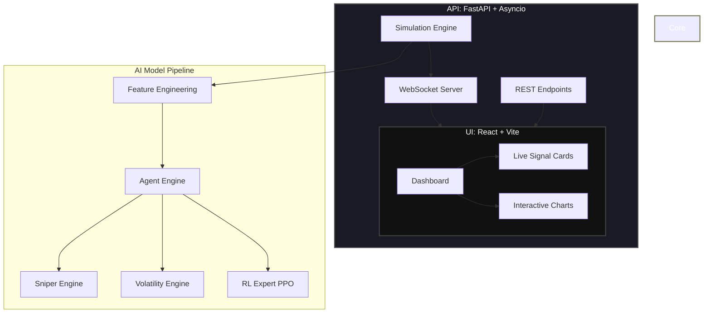

# 🦅 Signal.Engine

### Generative Algorithmic Intelligence for the Nifty 500

**Signal.Engine** is an autonomous market analysis system that moves beyond simple price prediction. It uses **Generative AI (Sequence Modeling)** to understand market context and **Reinforcement Learning (PPO)** to execute precision trades.


---

## 📑 Table of Contents

1. [Architecture Overview](#-architecture-overview)
2. [Key Features](#-key-features)
3. [Quick Start](#-quick-start)
4. [Documentation Map](#-documentation-map)
5. [Testing](#-testing)
6. [License](#-license)

---

## 🏗️ Architecture Overview

The system is designed with a high-performance backend serving a real-time "Industrial Luxury" dashboard, powered by a multi-expert AI engine.



---

## 🚀 Key Features

### 🧠 Generative Agent (v3.0)
- **Sequence Modeling (LSTM)**: Processes 50-candle sequences, not just snapshots, to understand the temporal context.
- **Supervised Fine-Tuning (SFT)**: Pre-trained on "Golden Labels" (ZigZag) for common sense market structure understanding.
- **RL Fine-Tuning (PPO)**: Optimized for risk-adjusted returns (Sortino Ratio) in a vectorized environment to act intelligently under uncertainty.

### ⚡ Real-Time Architecture
- **Async Backend**: FastAPI + asyncio for non-blocking, high-throughput analysis.
- **Live Websockets**: Real-time ticker updates and "Thinking" state broadcast directly to the UI.
- **Thread-Safe State**: Robust `threading.Lock` management for concurrent scanning and processing.
- **Global Error Tracing**: Request IDs (`X-Request-ID`) attached to every log and error for pinpoint debugging.

### 🎨 Modern Dashboard
- **React + Vite**: Fast, responsive UI built for modern browsers.
- **Live Signal Cards**: See what the agent is "thinking" in real-time, providing transparency into AI decision-making.
- **Interactive Charts**: Recharts-based performance visualization.
- **Design System**: Typography-driven, "Industrial Luxury" aesthetic combining sleekness with professional rigor.

---

## 🛠️ Quick Start

### Docker (Recommended)

The quickest way to get started is using Docker, which spins up the backend, frontend, and necessary services.

```bash
# 1. Configure env
cp .env.example .env

# 2. Run
docker-compose up -d
```
Access dashboard at **http://localhost:3000**.

### Manual

If you prefer to run the services natively or are developing, see **[DEPLOYMENT.md](DEPLOYMENT.md)** for detailed manual setup instructions.

---

## 📚 Documentation Map

To understand the system deeply, explore our structured documentation:

### Getting Started & Operations
- **[Deployment Guide](DEPLOYMENT.md)**: Detailed instructions for Docker, CI/CD, and Manual setup.
- **[Runbook](docs/runbook.md)**: Operational procedures for debugging, validation, and recovery.

### Architecture & Theory
- **[Project Manual](docs/PROJECT_MANUAL.md)**: Deep dive into the "Sniper" philosophy and overall architecture.
- **[Architecture Roadmap](docs/ARCHITECTURE_ROADMAP.md)**: The evolution of the agent from PPO to Generative trading.
- **[TDA Theory](docs/TDA_THEORY.md)**: The mathematical foundations behind Topological Data Analysis in our feature set.

### Engineering & Models
- **[Data Schemas](docs/DATA_SCHEMAS.md)**: Complete reference for internal data structures and feature engineering.
- **[Model Selection Playbook](docs/model-selection-playbook.md)**: Guidelines for choosing models for various tasks.
- **[Token Optimization](docs/token-optimization-guide.md)**: Strategies for reducing LLM token consumption.

### Analysis & Training
- **[Analysis Guide](docs/ANALYSIS_GUIDE.md)**: How to run backtests, statistical validation, and performance tracking.
- **[Kaggle Training Guide](docs/KAGGLE_TRAINING_GUIDE.md)**: Instructions for distributed training using Kaggle GPUs.
- **[Colab Notebook](notebooks/colab_training.md)**: Interactive training setup.

### Contribution Rules
- **[Project Rules](PROJECT_RULES.md)**: Canonical GSD methodology and rules.
- **[GSD Style](GSD-STYLE.md)**: Philosophy on meta-prompting and file structuring.

---

## 🧪 Testing

The project maintains high test coverage to ensure stability during rapid iteration:
- **Backend**: `pytest tests/` (50+ tests covering logic, API, and security).
- **Frontend**: `npm run test` (Vitest + React Testing Library).

---

## 📄 License

MIT License. See [LICENSE](LICENSE) for details.
