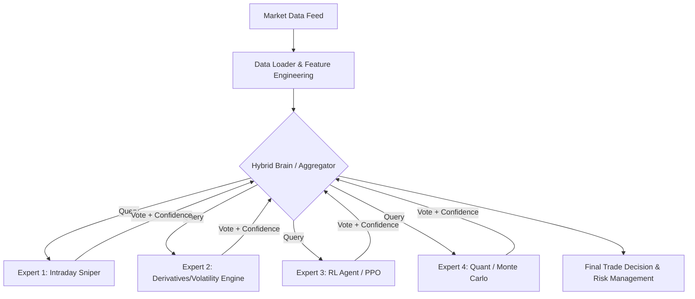

# Project Manual & Architecture Guide (Phase 2)

Welcome to the definitive guide on the **Signal.Engine** architecture. This document explains *how* the system is built, the underlying philosophy, and the path forward.

---

## 📑 Table of Contents

1. [Project Overview](#1-project-overview)
2. [Architecture & The "Expert" System](#2-architecture--the-expert-system)
3. [Data Pipeline](#3-data-pipeline)
4. [Development Rules](#4-development-rules)
5. [Current State & Strategic Roadmap](#5-current-state--strategic-roadmap)
6. [Analysis & Validation](#6-analysis--validation)
7. [Further Reading](#7-further-reading)

---

## 1. Project Overview

**Goal**: Build a "High Precision" Autonomous Trading Agent ("The Sniper").

**Philosophy**: We have actively shifted away from "Predicting Direction" (which often hovers around a coin-flip 50% accuracy) toward "Reacting to Volatility" (identifying high-confidence setups).

**Core Target Metrics**:
- **Win Rate**: >60%
- **Profit Factor**: >1.5
- **Methodology**: Intraday Momentum & Options Income

---

## 2. Architecture & The "Expert" System

Signal.Engine is built on a "Mixture of Experts" architecture. Instead of relying on a single monolithic model, the engine queries multiple specialized "Experts" and aggregates their votes.



### Core Components

1.  **Strategy Scanner (`scan_strategies.py`)**:
    - *Timeframe*: Daily.
    - *Purpose*: Filters the entire market universe (500+ stocks) for specific technical setups (e.g., Hammer, Engulfing).
    - *Output*: A refined Watchlist for the next trading day.

2.  **Intraday Sniper (`Expert 1`)**:
    - *Purpose*: Executes the "Sniper" momentum trades.
    - *Triggers*: VWAP cross, RSI Momentum, Volume Spikes.

3.  **Derivatives Engine (`Expert 2`)**:
    - *Purpose*: Generates income from "Neutral" or ranging stocks via Option Selling strategies (evaluating Historical Volatility Rank).

4.  **RL Agent (`Expert 3`)**:
    - *Purpose*: A Deep Learning (PPO) signal used as a "Booster." It provides non-linear pattern recognition for high-confidence setups.

5.  **Quant Expert (`Expert 4`)**:
    - *Purpose*: The "Validator." Runs Monte Carlo simulations (e.g., Heston Model) on shortlisted candidates to calculate mathematical Win Probability.

6.  **Analysis Framework (`src/analysis/`)**:
    - *Purpose*: Statistical validation of the trading edge and expert performance tracking.
    - *Features*: Automated chi-square tests, enhanced metrics (Sortino, Win Rate, Profit Factor).

---

## 3. Data Pipeline (`src/`)

The data pipeline is designed to be robust, avoiding heavy external dependencies where possible.

- **`data_loader.py`**: Handles Daily data fetching & Feature Engineering (RSI, EMA, Patterns).
- **`data_loader_intraday.py`**: Handles Live 15m/5m data fetching (Robust with Auto-Retry logic).
- **`patterns.py`**: Pure Python implementation of Candlestick Patterns (removes the notoriously tricky `talib` C-dependency).
- **`ticker_utils.py`**: Manages the S&P 500 & Nifty 50 ticker lists dynamically.
- **`metrics_enhanced.py`**: Calculates advanced performance metrics (Sortino, Win Rate, Profit Factor, Calmar).
- **`analysis/`**: Modular analysis framework containing scripts like `expert_performance.py` and `edge_validation.py`.

---

## 4. Development Rules

To maintain the integrity of "The Sniper", all contributions must adhere to these rules:

1.  **Deterministic Logic First**: No blind "Black Box" Neural Networks. All rules must be explainable (e.g., "Bought because RSI < 30 and VWAP crossed"). ML is an enhancement, not the sole decision-maker.
2.  **Strict Risk Management**: Every trade *must* have a systematic Stop Loss and Take Profit defined in the logic.
3.  **Modular Code**: Keep modules highly focused. One script = One specific job.

---

## 5. Current State & Strategic Roadmap

### Current State (Feb 2026)
- ✅ **Daily Scanner**: Active (Scans 550 tickers).
- ✅ **Intraday Engine** (Expert 1): Active.
- ✅ **Volatility Engine** (Expert 2): Active.
- ✅ **RL Agent** (Expert 3): Active.
- ✅ **Quant Expert** (Expert 4): Active.
- ✅ **Hybrid Brain**: Active (`scan_hybrid.py` Aggregator).
- ✅ **Analysis Framework**: Active (Statistical validation).
- ✅ **Analytics Dashboard**: Active (React UI).
- 🗑️ **Legacy ML**: Deprecated (Moved to `archive/`).

### Roadmap
- **Phase 1**: Intraday Scanner for "Momentum" ✅
- **Phase 2**: Volatility Scanner for "Income" ✅
- **Phase 3**: Live Dashboard & Aggregator ✅
- **Phase 4**: Statistical Validation Framework ✅
- **Phase 5**: Live Broker Integration (Next Frontier) 🔄

---

## 6. Analysis & Validation

Signal.Engine includes a built-in suite to prove its edge mathematically.

### Running Performance Analysis
```bash
python -m src.analysis.runner
```

### Available Analyses
1. **Expert Performance**: Compares confidence distributions and activity across all 4 experts.
2. **Edge Validation**: Performs statistical significance testing (chi-square) to prove the trading edge isn't just luck.

### Enhanced Metrics Tracked
- **Sortino Ratio**: Downside-adjusted returns (penalizes only downside volatility).
- **Win Rate**: % of profitable trades.
- **Profit Factor**: Gross profit / Gross loss.
- **Calmar Ratio**: Annualized return / Maximum drawdown.

### Viewing Results
- **Charts**: Generated in `output/expert_performance.png`, `output/edge_validation.png`.
- **Data Reports**: Generated as `output/*.json`.
- **Dashboard**: View interactively at `http://localhost:5173/analytics`.

---

## 7. Further Reading

For deeper technical details, explore the following documentation:

- **[Data Schemas](DATA_SCHEMAS.md)**: Complete reference for data structures passed between components.
- **[Architecture Roadmap](ARCHITECTURE_ROADMAP.md)**: Detailed history of the evolution from PPO to Generative AI.
- **[Analysis Guide](ANALYSIS_GUIDE.md)**: Instructions for running backtests and parsing results.
- **[TDA Theory](TDA_THEORY.md)**: The math behind our Topological Data Analysis features.
- **[Experiments Log](research/experiments_log.md)**: Our failure analysis and learnings from earlier LSTM models.

---

*Updated: February 2026*
