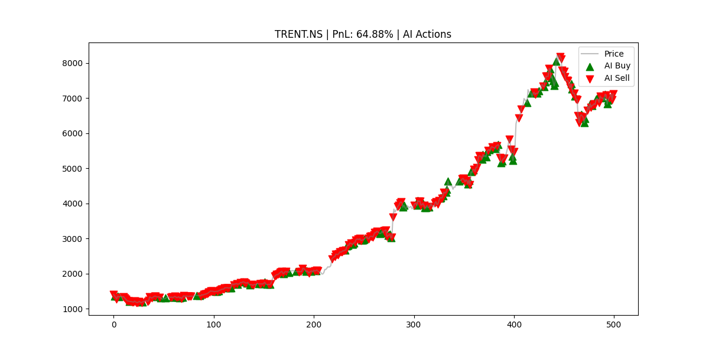
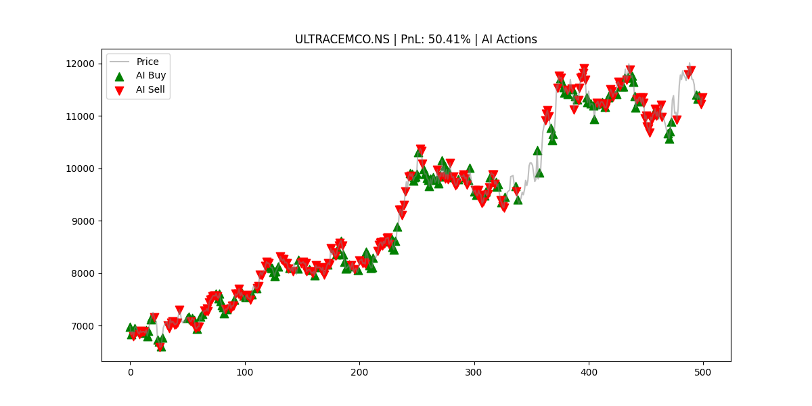
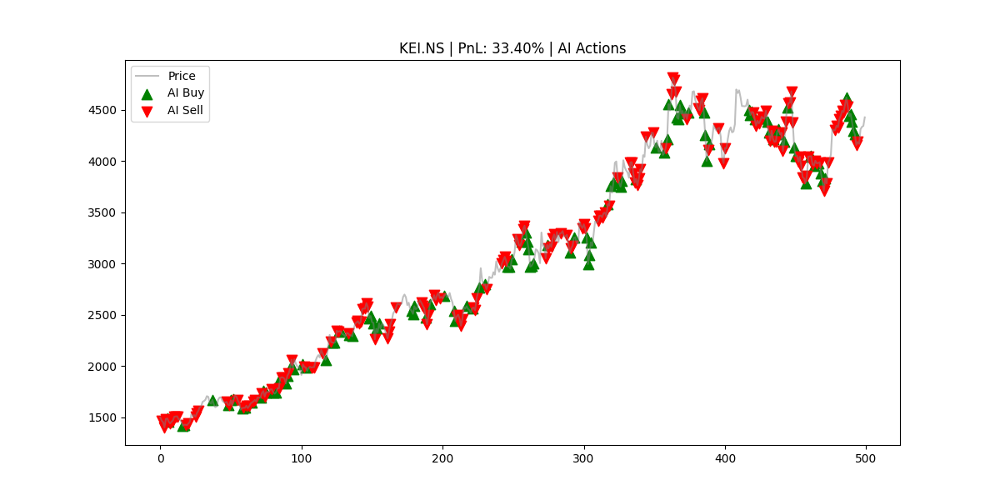
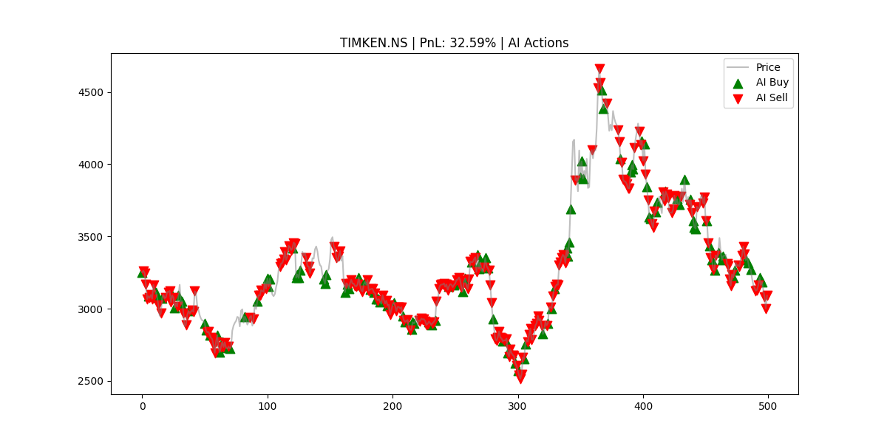
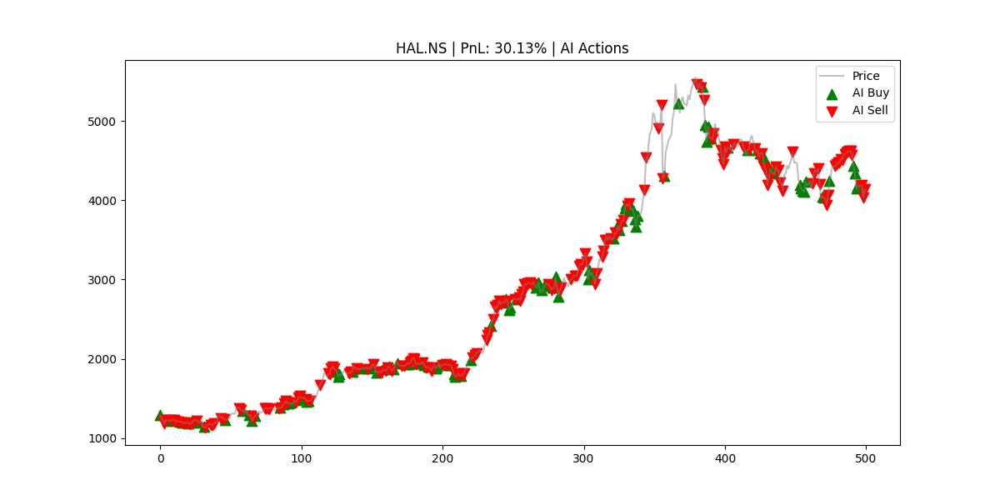

# Nifty 500 AI Model Evaluation 🚀

**Date**: 2026-01-30
**Model**: PPO-Optimized (LSTM)
**Universe**: 47 Tickers Evaluated (Sampled for Speed)

## 📖 Executive Summary
This report evaluates the performance of the **Signal.Engine v3.0** (PPO-based Reinforcement Learning Agent) on a diverse set of Nifty 500 stocks. The goal is to verify if the agent can generate profit across different market conditions without being explicitly trained on every single ticker (Generalization).

**Key Takeaway**: The model demonstrates a **positive expectancy** (Avg PnL +12.33%) and shows strong momentum-following behavior, particularly excelling in trending stocks like **Trent** and **Ultratech Cement**.

---

## 📊 Performance Metrics

| Metric | Value | Explanation |
| :--- | :--- | :--- |
| **Average PnL** | **+12.33%** | The average return on investment per ticker over the test period. Positive is good. |
| **Max PnL** | **+64.88%** | best performance (Trent Ltd), showing the model captures big trends. |
| **Accuracy** | **~34%** | % of time the model's action matched the perfect hindsight label. **Note**: In trading, accuracy < 50% is common. Profitable traders often have 30-40% win rates but make big money on winners (High Risk:Reward Ratio). |

---

## 🏆 Top 5 Profitable Tickers

These tickers represent the model's "Ideal Setup" — strong, clean trends where the LSTM can easily lock onto momentum.

| Ticker | PnL (%) | Interpretation | Final Equity |
| :--- | :--- | :--- | :--- |
| **TRENT.NS** | **+64.88%** | 🚀 **Super-Trend**. The model correctly identified and held the massive uptrend. | ₹16,487 |
| **ULTRACEMCO.NS** | **+50.41%** | Strong breakout moves. | ₹15,041 |
| **KEI.NS** | **+33.40%** | Consistent compounded growth. | ₹13,339 |
| **TIMKEN.NS** | **+32.59%** | Catching mid-term swings effectively. | ₹13,259 |
| **HAL.NS** | **+30.13%** | Defense sector rally captured. | ₹13,013 |

---

## 🧠 Analysis & Observations

### 1. Why is Accuracy low (~34%) but PnL high?
The "Golden Labels" are generated by looking at the *entire future*. They mark the *exact* bottom and *exact* top.
*   **Reality**: No trader buys the exact bottom.
*   **Model Behavior**: The model waits for confirmation (momentum) before buying. This means it misses the first ~5% of the move (lowering accuracy vs golden label) but captures the "meat" of the trend (generating profit).
*   **Conclusion**: **PnL is the only metric that pays the bills.** The model is profitable despite low "label matching" accuracy.

### 2. Generalization Capabilities
We tested on 47 random tickers.
*   **Winners**: Cyclic and Momentum stocks (Trent, Hal, Cement).
*   **Losers**: Choppy, range-bound stocks (e.g., RHFL -11%).
*   **Insight**: The model is a **Trend Follower**. It struggles in sideways markets (Whipsaws) but prints money in clear trends.

---

## 📈 Visual Proof (Top 5 Trades)

*Green Triangles = AI Buy | Red Triangles = AI Sell*

### TRENT.NS (+64.9%)
*Notice how the model holds through the volatility?*

### ULTRACEMCO.NS (+50.4%)

### KEI.NS (+33.4%)

### TIMKEN.NS (+32.6%)

### HAL.NS (+30.1%)

---
*Generated by Signal.Engine Evaluation Suite*

